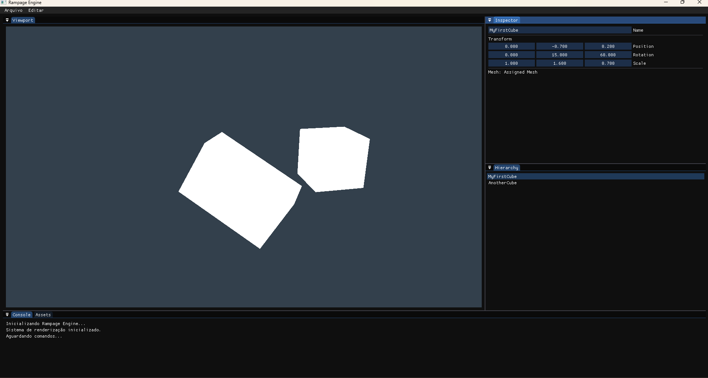

# ================================== \[Rampage Engine - Funções do Código Explicadas] ==================================

## Rampage Engine - Editor Preview

## Índice

1. [Estrutura Geral / Overall Structure](#estrutura-geral--overall-structure)
2. [Divisão dos Arquivos / File Breakdown](#divisão-dos-arquivos--file-breakdown)

   * [main.cpp](#maincpp)
   * [shader.h / shader.cpp](#shaderh--shadercpp)
   * [camera.h / camera.cpp](#camerah--cameracpp)
   * [engineui.h / engineui.cpp](#engineuih--engineuicpp)
   * [framebuffer.h / framebuffer.cpp](#framebufferh--framebuffercpp)
   * [mesh.h / mesh.cpp](#meshh--meshcpp)
   * [glad.c](#gladc)
3. [Relações e Fluxo / Relationships and Flow](#relações-e-fluxo--relationships-and-flow)

---

## Estrutura Geral / Overall Structure

**Português:**
Esta é uma estrutura básica de engine 3D utilizando C++, OpenGL (via GLAD e GLFW), GLM para matemática e ImGui para a interface do usuário. O objetivo é criar um ambiente de editor simples onde uma cena 3D é renderizada em uma textura, que então é exibida dentro de um painel ImGui (o "Viewport").

**English:**
This is a basic 3D engine structure using C++, OpenGL (via GLAD and GLFW), GLM for math, and ImGui for the user interface. The goal is to create a simple editor environment where a 3D scene is rendered into a texture, which is then displayed within an ImGui panel (the "Viewport").

---

## Divisão dos Arquivos / File Breakdown

### main.cpp

**Português:**
**Propósito:** Ponto de entrada principal e coordenador central da aplicação.
**Responsabilidades:**

* Inicializa o GLFW.
* Cria a janela principal.
* Inicializa o GLAD.
* Inicializa o sistema EngineUI.
* Cria um objeto Framebuffer para renderizar a cena.
* Conecta o Framebuffer ao EngineUI.
* Cria uma Câmera, Shader e Mesh.
* Loop principal:

  * Processa eventos.
  * Verifica o tamanho do painel Viewport do ImGui.
  * Redimensiona o Framebuffer se necessário.
  * Renderiza a cena 3D:

    * Faz bind no Framebuffer.
    * Limpa e configura o OpenGL.
    * Calcula as matrizes Model, View, Projection.
    * Usa o Shader, envia as matrizes.
    * Desenha a Mesh (cubo).
    * Desfaz o bind do Framebuffer.
  * Renderiza a interface com EngineUI.
  * Troca os buffers da janela.
  * Libera os recursos ao fechar.

**English:**
**Purpose:** Main entry point and central coordinator of the application.
**Responsibilities:**

* Initializes GLFW.
* Creates the main window.
* Initializes GLAD.
* Initializes EngineUI system.
* Creates a Framebuffer to render the 3D scene.
* Links the Framebuffer to EngineUI.
* Creates a Camera, Shader, and Mesh.
* Main loop:

  * Processes events.
  * Gets ImGui viewport panel size.
  * Resizes Framebuffer if needed.
  * Renders 3D scene:

    * Binds the Framebuffer.
    * Clears and sets OpenGL state.
    * Computes Model, View, Projection matrices.
    * Uses Shader, sets matrices.
    * Draws the Mesh (cube).
    * Unbinds the Framebuffer.
  * Renders UI via EngineUI.
  * Swaps window buffers.
  * Cleans up on exit.

---

### shader.h / shader.cpp

**Português:**
**Propósito:** Gerencia programas de Shader do OpenGL.
**Responsabilidades:**

* Carrega código-fonte dos arquivos .vert e .frag.
* Compila e faz link dos shaders.
* Verifica erros de compilação e linkagem.
* Métodos para ativar e enviar dados para o shader (ex: SetMat4()).

**English:**
**Purpose:** Manages OpenGL Shader Programs.
**Responsibilities:**

* Loads shader source from .vert and .frag files.
* Compiles and links shaders.
* Performs error checking.
* Methods to activate shader and send data (e.g., SetMat4()).

---

### camera.h / camera.cpp

**Português:**
**Propósito:** Representa a câmera virtual da cena 3D.
**Responsabilidades:**

* Armazena orientação (yaw, pitch) e posição.
* Processa entrada do mouse (orbit, pan, zoom).
* Calcula e fornece a View Matrix.

**English:**
**Purpose:** Represents the virtual camera in the 3D scene.
**Responsibilities:**

* Stores orientation (yaw, pitch) and position.
* Processes mouse input (orbit, pan, zoom).
* Computes and returns the View Matrix.

---

### engineui.h / engineui.cpp

**Português:**
**Propósito:** Gerencia a interface do usuário com Dear ImGui.
**Responsabilidades:**

* Inicializa e finaliza o ImGui.
* Configura docking.
* Métodos para começar e encerrar o frame.
* Desenha os painéis da interface (Dockspace, Viewport, Hierarchy, etc.).
* Usa ImGui::Image para mostrar o conteúdo do Framebuffer no Viewport.

**English:**
**Purpose:** Manages the Dear ImGui user interface.
**Responsibilities:**

* Initializes and shuts down ImGui.
* Sets up docking.
* Wraps ImGui frame start/end.
* Renders panels (Dockspace, Viewport, Hierarchy, etc.).
* Uses ImGui::Image to show Framebuffer content in Viewport.

---

### framebuffer.h / framebuffer.cpp

**Português:**
**Propósito:** Encapsula um Framebuffer Object do OpenGL.
**Responsabilidades:**

* Cria e gerencia o FBO, textura de cor e buffer de profundidade/stencil.
* Métodos de Bind() e Unbind().
* Fornece GetTextureID() para o EngineUI exibir a cena.
* Suporta redimensionamento (Resize()).
* Libera os recursos no destrutor.

**English:**
**Purpose:** Encapsulates an OpenGL Framebuffer Object.
**Responsibilities:**

* Creates/manages FBO, color texture, and depth/stencil buffer.
* Provides Bind() and Unbind() methods.
* GetTextureID() allows EngineUI to show scene.
* Supports resizing (Resize()).
* Cleans up in destructor.

---

### mesh.h / mesh.cpp

**Português:**
**Propósito:** Representa os dados de geometria de um modelo 3D.
**Responsabilidades:**

* Define vértices e índices a partir de um arquivo .obj simples.
* Cria e gerencia VAO, VBO e EBO.
* Envia os dados para a GPU.
* Desenha a mesh com Draw().

**English:**
**Purpose:** Represents 3D model geometry and its OpenGL buffers.
**Responsibilities:**

* Loads vertex/index data from a simple .obj file.
* Creates VAO, VBO, EBO.
* Uploads data to GPU.
* Draws the mesh via Draw().

---

### glad.c

**Português:**
**Propósito:** Biblioteca para carregar funções do OpenGL.
**Responsabilidades:**

* Implementação gerada pelo serviço GLAD.
* Carrega os ponteiros de função OpenGL após o contexto ser criado.

**English:**
**Purpose:** OpenGL Loading Library.
**Responsibilities:**

* Implementation from GLAD service.
* Loads OpenGL function pointers at runtime.

---

## Relações e Fluxo / Relationships and Flow

**Português:**

* main.cpp inicializa tudo: GLFW, GLAD e ImGui via EngineUI.
* Cria objetos: Camera, Shader, Mesh, Framebuffer.
* Associa o Framebuffer ao EngineUI.

No loop principal:

1. Verifica mudanças no tamanho do Viewport.
2. Redimensiona o Framebuffer se necessário.
3. Faz bind no Framebuffer.
4. Obtém a matriz View da Camera.
5. Usa o Shader, envia matrizes, desenha a Mesh.
6. Desfaz o bind do Framebuffer.
7. Chama o EngineUI para renderizar a interface.
8. Exibe a imagem final trocando os buffers da janela.

**English:**

* main.cpp initializes everything: GLFW, GLAD, and ImGui via EngineUI.
* Creates: Camera, Shader, Mesh, Framebuffer.
* Connects Framebuffer to EngineUI.

In the main loop:

1. Checks if Viewport size changed.
2. Resizes Framebuffer if needed.
3. Binds the Framebuffer.
4. Gets View matrix from Camera.
5. Uses Shader, sets matrices, draws Mesh.
6. Unbinds Framebuffer.
7. Calls EngineUI to render UI.
8. Displays final image by swapping window buffers.

---